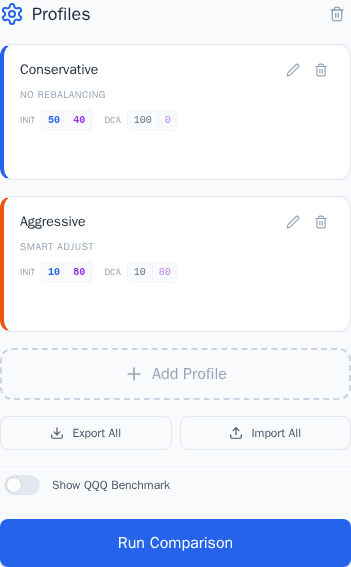
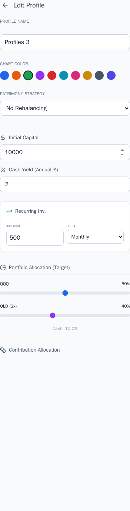
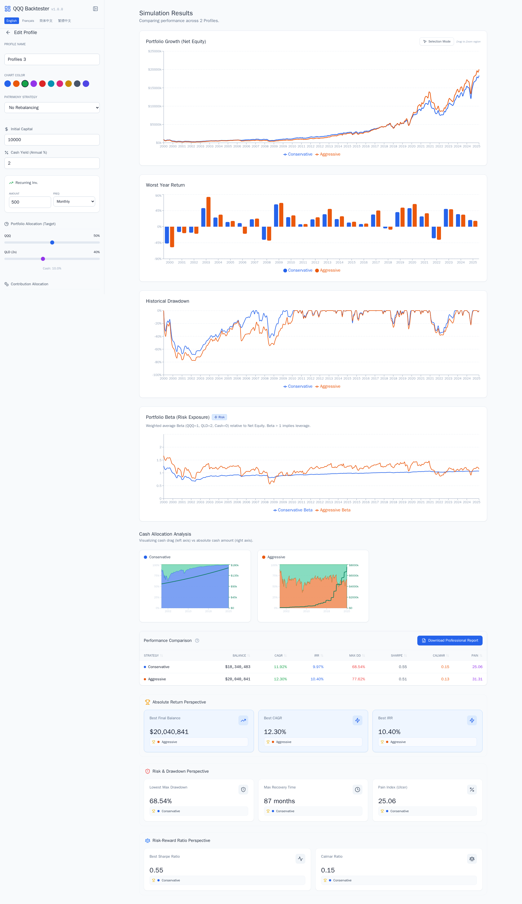

<div align="center">

# 📈 CLEC Strategy Backtest

**A High-Performance Investment Simulation & Strategic Risk Analysis Platform**

[](https://vitejs.dev/)
[](https://reactjs.org/)
[](https://www.typescriptlang.org/)
[](https://tailwindcss.com/)
[](https://capacitorjs.com/)
[](https://www.docker.com/)
[](https://web.dev/progressive-web-apps/)

</div>

---

## 🚀 Overview

**CLEC Strategy Backtest** is a sophisticated financial tool designed for serious investors to simulate, analyze, and optimize investment strategies using historical market data (specifically focusing on QQQ/QLD assets). It goes beyond simple calculators by modeling complex scenarios including leverage, margin calls, interest accrual, and inflation-adjusted living expenses.

## ✨ Key Features

### 🛠 Powerful Simulation Engine

- **Multi-Asset Allocation**: Mix and match QQQ (Nasdaq-100) and QLD (2x Leveraged Nasdaq-100).
- **Advanced Leverage Modeling**:
  - Interactive LTV (Loan-to-Value) tracking.
  - Automatic margin call/liquidation triggers when safety limits are breached.
  - Capitalized interest for unpaid loan balances.
- **Dynamic Cash Management**: Supports interest-bearing cash reserves and flexible contribution intervals.

### 🧠 Investment Strategies

**Note**: All strategies support configurable DCA (Monthly/Quarterly/Yearly) with custom asset allocation for initial capital and ongoing contributions.

- **No Rebalance** (Buy & Hold): Simple strategy that maintains initial allocation. Monthly/quarterly/yearly contributions follow configured contribution weights without rebalancing.

- **Yearly Rebalancing**: Standard DCA with automatic portfolio rebalancing to target weights every January. Maintains target asset allocation over time.

- **Smart Adjust**: Dynamic strategy that tracks QLD performance annually.
  - **Bull Market (QLD Profit > 0)**: Sell 1/3 of profits to increase cash reserves.
  - **Bear Market (QLD Profit ≤ 0)**: Deploy up to 2% of portfolio value to buy QLD on dips using available cash.

- **Flexible Rebalancing - Defensive (Type 1)**: Cash-buffer focused strategy with 15-year expense target (configurable).
  - **Cash Inadequate (< Target)**:
    - Bull: Harvest 1/3 of QLD profits to cash
    - Bear: Rebalance 2% from QQQ to QLD (leveraging bear market exposure)
  - **Cash Adequate (≥ Target)**: Apply Smart Rebalance logic (harvest profits or buy dips with cash)

- **Flexible Rebalancing - Aggressive (Type 2)**: Growth-focused variant for investors with adequate cash reserves.
  - **Cash Inadequate (< Target)**: Same defensive behavior as Type 1
  - **Cash Adequate (≥ Target)**:
    - Bull: Reinvest 1/3 of QLD profits into QQQ (not cash) to compound gains
    - Bear: Smart dip buying with cash (same as Type 1)

### 📊 Professional Analytics & Reporting

- **In-depth Metrics**: CAGR, IRR, Sharpe Ratio, Ulcer Index (Pain Index), Max Drawdown, and Calmar Ratio.
- **AI-Readable PDF Reports**: Generate comprehensive PDF summaries with charts and tables optimized for both humans and AI analysis.
- **Real-time Visualization**: Interactive charts powered by Recharts for equity curves and risk metrics.

### 🌐 Global & Versatile

- **i18n Ready**: Fully localized interface support.
- **Cross-Platform**: Built with Capacitor for seamless transition to mobile platforms (Android/iOS).

### 📱 Mobile & PWA Features

- **Progressive Web App (PWA)**: Install directly from browser on any device.
- **Native Mobile Apps**: Full Android APK and iOS IPA builds with app store deployment.
- **Haptic Feedback**: Native touch feedback for enhanced mobile experience.
- **Offline Capability**: Service worker enables offline functionality.
- **Mobile-Optimized UI**: Touch-friendly interface with safe area support for modern devices.
- **Native File Sharing**: PDF reports shared through native mobile sharing sheets.

---

## 🛠 Tech Stack

- **Frontend**: React 18 with Vite
- **Language**: TypeScript (Strict Typing)
- **Styling**: Tailwind CSS
- **Charts**: Recharts
- **PDF Generation**: jsPDF + jspdf-autotable + html2canvas
- **Mobile**: Capacitor with plugins (Haptics, Filesystem, Share, Preferences, Status Bar, Splash Screen)
- **PWA**: Vite PWA plugin with service worker
- **Deployment**: Docker & Docker Compose

---

## 📸 Screenshots

### Profiles Section



Manage and compare multiple investment strategies side-by-side. Each profile can be customized with:

- Different asset allocation strategies
- Leverage and risk settings
- Contribution schedules

### Add Profile Form



Configure individual strategy parameters including:

- Initial capital and contribution amounts
- Asset allocation weights (QQQ/QLD/Cash)
- Leverage settings (interest rates, LTV limits, collateral ratios)
- Strategy selection (5 strategies available)

### Results Dashboard



View comprehensive performance metrics:

- CAGR, IRR, Sharpe Ratio, Max Drawdown
- Calmar Ratio, Ulcer Index, Recovery Time
- Interactive comparison charts

## 📱 Mobile Apps & PWA

**CLEC Strategy Backtester** is available as both a Progressive Web App (PWA) and native mobile applications for Android and iOS.

### 🌐 Progressive Web App (PWA)

Install directly from your browser - no app store required!

#### Installation Steps:

**On Android Chrome:**

1. Open `http://your-server:4173` in Chrome
2. Tap the menu (⋮) → "Add to Home screen"
3. Name it "Backtester" → "Add"
4. App icon appears on home screen

**On iOS Safari:**

1. Open `http://your-server:4173` in Safari
2. Tap Share button → "Add to Home Screen"
3. Tap "Add" in top right
4. App icon appears on home screen

#### PWA Features:

- ✅ Install from browser
- ✅ Offline functionality
- ✅ Native app-like experience
- ✅ Automatic updates
- ✅ No app store restrictions

### 📱 Native Mobile Apps

Full native Android and iOS applications with enhanced mobile features.

#### Android APK Build:

```bash
# Install dependencies
bun add @capacitor/android

# Add Android platform
bunx cap add android

# Build and sync
bun run build
bunx cap sync android

# Build APK (requires Android Studio)
bunx cap open android
# Then in Android Studio: Build → Build Bundle(s)/APK(s) → Build APK(s)
```

#### iOS IPA Build (macOS only):

```bash
# Install dependencies
bun add @capacitor/ios

# Add iOS platform
bunx cap add ios

# Build and sync
bun run build
bunx cap sync ios

# Build IPA (requires Xcode)
bunx cap open ios
# Then in Xcode: Product → Archive → Distribute App
```

### 🎯 Mobile Features:

- **Haptic Feedback**: Native touch vibrations for interactions
- **Native File Sharing**: PDF reports shared through system sharing sheets
- **Safe Area Support**: Proper display on devices with notches/screens
- **Touch Optimization**: 44px minimum touch targets for accessibility
- **Offline Storage**: Data persists between app sessions
- **Native Performance**: Optimized for mobile hardware

### 🧪 Testing Mobile Apps:

#### Web Testing (PWA):

```bash
# Start development server
bun run dev --host --port 5173
# Access: http://192.168.1.x:5173
```

#### Native Testing:

```bash
# Build and sync to devices
bun run build
bunx cap sync
bunx cap run android  # Test on connected Android device
bunx cap run ios      # Test on connected iOS device (macOS)
```

## 💻 Getting Started

### Prerequisites

- Node.js (Latest LTS recommended)
- Docker (Optional, for containerized deployment)
- **For Mobile Development:**
  - Android Studio (for Android APK builds)
  - Xcode (for iOS IPA builds, macOS only)
  - Java JDK 11+ (for Android)

### Local Development

1. **Clone & Install**:
   ```bash
   bun install
   ```
2. **Launch Web App**:

   ```bash
   bun run dev
   ```

3. **Launch with Network Access (for mobile testing)**:
   ```bash
   bun run dev --host --port 5173
   # Access: http://192.168.1.x:5173
   ```

### Docker Deployment

```bash
docker-compose up -d
```

### Mobile App Development

#### First-Time Setup:

```bash
# Install mobile platforms
bun add @capacitor/android @capacitor/ios

# Add native platforms
bunx cap add android
bunx cap add ios
```

#### Development Workflow:

```bash
# After making web app changes
bun run build
bunx cap sync  # Sync web assets to native apps

# Test on devices
bunx cap run android  # Test on Android device
bunx cap run ios      # Test on iOS device (macOS)

# Build release APKs/IPAs
bunx cap build android  # Opens Android Studio
bunx cap build ios      # Opens Xcode
```

---

## 🔄 Simulation Flow

The simulation engine follows a systematic monthly iteration process:

### Flow Diagram



**Note**: The SVG includes two sections:

- **Top**: 5 Investment Strategies with their core logic explained
- **Bottom**: Simulation process flow with animated elements

#### Strategy Breakdown:

1. **No Rebalance** (Green): Simple buy-and-hold approach. Maintain initial allocation, DCA follows contribution weights only.

2. **Yearly Rebalancing** (Blue): Annual reset to target allocation in January. Maintains desired asset mix over time.

3. **Smart Adjust** (Purple): Dynamic strategy. Bull markets: Sell 1/3 profit to cash. Bear markets: Buy 2% dip with available cash.

4. **Flexible Defensive** (Orange): Cash-buffer focused. Maintain 15-year cash reserve. Defensive when insufficient (harvest profits or rebalance to QLD). Smart mode when adequate.

5. **Flexible Aggressive** (Red): Growth-oriented. Same defensive when cash low. Bull: Reinvest profits into QQQ (not cash) to compound gains.

### Key Process Steps

1. **Initialization**: Set up portfolio with zero positions (QQQ: 0, QLD: 0, Cash: 0, Debt: 0)

2. **Monthly Banking**:
   - Accrue cash interest (based on `cashYieldAnnual`)
   - Calculate debt interest based on selected mode:
     - **MONTHLY**: Pay from cash, capitalize shortfall
     - **MATURITY**: Accrue only (no cash flow)
     - **CAPITALIZED**: Add to debt principal (compound interest)

3. **Strategy Execution**: Apply selected strategy function (No Rebalance, Yearly Rebalance, Smart Adjust, Flexible 1/2)

4. **Leverage Management**:
   - Calculate effective collateral (using pledge ratios)
   - Check LTV (Loan-to-Value) against `maxLtv` threshold
   - Trigger margin call/liquidation if safety limits breached

5. **Risk Metrics**: Calculate performance indicators (CAGR, IRR, Sharpe Ratio, Max Drawdown, etc.)

## 📂 Project Structure

- `components/`: Modular UI components (ResultsDashboard, ConfigPanel, etc.)
- `services/`: Core logic (simulationEngine, financeMath, strategyDefinitions, storage, haptics)
- `docs/`: Evolution path and documentation.
- `constants.ts`: Global configuration and initial data sets.
- `types.ts`: Shared TypeScript interfaces.
- `capacitor.config.ts`: Capacitor configuration for mobile apps
- `android/` & `ios/`: Native platform projects (generated, not committed to git)
- `public/`: Static assets including PWA icons and manifest

### 📱 Mobile Development Notes

- **Native platforms** (`android/` and `ios/`) are **not committed** to version control
- Regenerate them with: `cap add android` / `cap add ios`
- Mobile plugins are synced automatically via `cap sync`
- PWA assets are in `public/` directory

### 📜 Available Scripts

- `bun run dev` - Start development server
- `bun run build` - Build production web app
- `bun run preview` - Preview production build
- `bun run mobile:sync` - Build and sync to mobile platforms
- `bun run test` - Run unit tests
- `bun run lint` - Run ESLint
- `bun run format` - Format code with Prettier

### 🔧 Mobile Development Tips

#### Common Issues & Solutions:

**PWA Not Installing:**

- Ensure serving over HTTPS (or localhost for development)
- Check browser console for service worker errors
- Clear browser cache and try incognito mode

**Android Build Fails:**

- Install Android Studio and SDK
- Set ANDROID_HOME environment variable
- Accept SDK licenses: `sdkmanager --licenses`

**iOS Build Fails (macOS):**

- Install Xcode from App Store
- Accept Xcode license: `sudo xcodebuild -license accept`
- Install CocoaPods: `brew install cocoapods`

**Plugin Sync Issues:**

- Run `bunx cap sync` after adding new plugins
- Check capacitor.config.ts for correct plugin configuration
- Rebuild native platforms if plugins change significantly

### 🚀 App Store Deployment

#### Google Play Store (Android):

1. Build AAB bundle in Android Studio
2. Create Google Play Console account ($25 one-time fee)
3. Upload AAB and fill store listing
4. Set up internal/beta/alpha testing (recommended first)
5. Submit for production release

#### Apple App Store (iOS):

1. Build IPA in Xcode
2. Create Apple Developer account ($99/year)
3. Upload IPA via App Store Connect
4. Configure app metadata and screenshots
5. Submit for App Review (7-10 days)

#### PWA Benefits:

- **No app store fees** or approval processes
- **Instant updates** - no resubmission required
- **Cross-platform** - works on any device with a browser
- **Offline capable** - functions without internet

---

<div align="center">
Made with ❤️ for Strategic Investors
</div>
